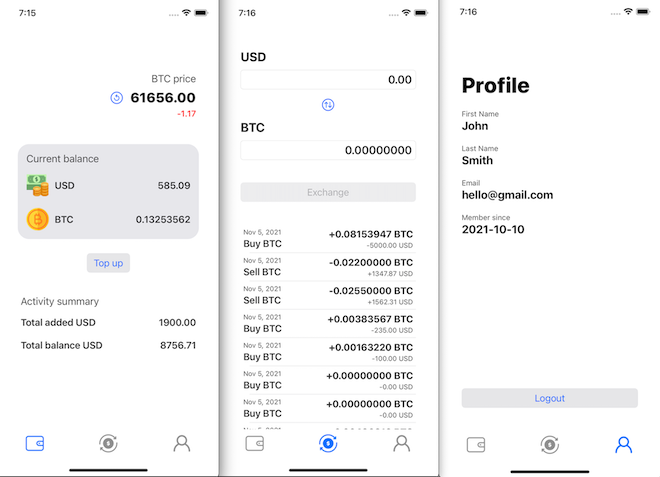

# Udacity iOS Nanodegree Capstone Project - Safe Crypto Trader App

## Overview

This is the repository for my final project for [Udacity's iOS Developer Nanodegree.](https://www.udacity.com)

## Description

Bitcoin value has risen over 80 percent in the past several months to reach all-time high above $66,000 per coin. Supporters insist Bitcoin is a hedge against inflation and say that the price would rise upto $100,000 by the end of the year 2021. Skeptics, including Warren Buffett and Charlie Munger, see a Bitcoin as a bubble, a "rat poison" and an asset without an intrinsic value. Nevertheless, FOMO (fear of missing out) has recently attracted many new investors to the crypto markets. Most of the new investors may not be fully ready to experience an emotional roller coaster due to an extreme Bitcoin volatility and unpredictable behaviour. 

Therefore, I have created this app as a safe place to try investing in Bitcoin without the risk of loosing money. All the transactions are performed locally and no money would be lost if the Bitcoin price drops quickly. A user can create an account and top up fake US dollars to the app. Then when the price is good to buy, the user can buy the Bitcoin and store it. The user can also sell the Bitcoin and convert the coin back to the US dollars. The app shows the total balance of both currencies and the total USD amount added to the account. By comparing these numbers, the user can decide if they made some profit over the time or not.

## Environment

Since technology is ever evolving, and Apple updates it's development environment yearly, deprecating features and updating languages fast, I cannot guarantee for how long this code will continue working. This app was created with the following environment in mind:

* OSX BigSur
* XCode 13.1
* Swift 5
* iOS 15

### Cocoa Pods

This project uses [CocoaPods](https://cocoapods.org/) for it's dependencies. To initalize the project you should first install CocoaPods and then initialize the dependencies by running

> pod install

on ARM architecture run

> arch -x86_64 pod install

After that, open the project using the SafeCryptoTrader.xcworkspace created by CocoaPods.

#### Libraries used by this project:
* [Firebase Auth](https://firebase.google.com/products/auth)
* [Firestore](https://firebase.google.com/products/firestore)

## Limitations
* The transaction and account data are stored locally and accessed via CoreData. I could have used Firebase Realtime Database but I had issues with resolving dependencies when installing the Firebase Realtime Database pod on my M1 machine.

## Contributing
Since this project is a personal project created for education pruposes, no external contributions will be accepted. However, you are free to fork and study the code! If you want to use this code on your own application, feel free to do so, following this repository's license. Just remember, when presenting Udacity projects, you should follow Udacity's code of conduct. If you are checking this project to help on your own Udacity project, feel free to use this code for inspiration, but please try to make everything on your own.

## License
The contents of this repository are covered under the [MIT License](LICENSE).
